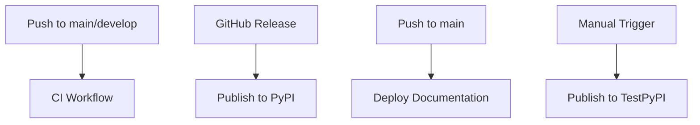

# GitHub Actions Workflows

This directory contains the GitHub Actions workflows for the AI Ops project.

## Workflows

### CI Workflow (`ci.yml`)

Runs continuous integration tests on every push and pull request:

- Checks documentation build
- Validates Poetry lock file
- Runs linters (ruff format, ruff lint, yamllint)
- Runs Docker-based tests
- Checks migrations and app configuration
- Runs unit tests
- Validates changelog entries on PRs

**Triggers:**
- Push to `main` or `develop` branches
- Push tags starting with `v*`
- Pull requests

### Deploy Documentation (`deploy-docs.yml`)

Builds and deploys documentation to GitHub Pages:

- Builds documentation with MkDocs
- Deploys to GitHub Pages

**Triggers:**
- Push to `main` branch
- Manual workflow dispatch

### Publish to PyPI (`publish-pypi.yml`)

Builds and publishes the package to PyPI or TestPyPI:

- Builds Python distribution packages (wheel and sdist)
- Validates package metadata
- Publishes to PyPI on releases
- Supports TestPyPI for testing via workflow dispatch
- Updates GitHub release notes with installation instructions

**Triggers:**
- GitHub release published (for PyPI)
- Manual workflow dispatch (for TestPyPI testing)

**Requirements:**
- PyPI Trusted Publishing must be configured (see [PyPI Publishing Setup](../../docs/dev/pypi_publishing.md))
- GitHub environments `pypi` and `testpypi` must be created

## Workflow Dependencies

## Secrets and Variables

No secrets are required for these workflows. The Publish to PyPI workflow uses Trusted Publishing via OpenID Connect (OIDC), eliminating the need for API tokens.

## Environment Variables

### CI Workflow
- `APP_NAME`: Application name (`ai_ops`)
- `POETRY_VERSION`: Poetry version to use (`2.1.3`)
- `INVOKE_AI_OPS_LOCAL`: Set to `True` for local development
- `INVOKE_AI_OPS_PYTHON_VER`: Python version for matrix builds
- `INVOKE_AI_OPS_NAUTOBOT_VER`: Nautobot version for matrix builds

### Publish to PyPI
- `POETRY_VERSION`: Poetry version to use (`2.1.3`)

## Maintenance

### Updating Poetry Version

To update the Poetry version used across workflows:

1. Update the `POETRY_VERSION` in each workflow file
2. Test the workflows in a pull request before merging

### Adding New Workflows

When adding new workflows:

1. Follow the existing naming convention
2. Add appropriate triggers
3. Use the project's yamllint configuration for validation
4. Document the workflow in this README
5. Add necessary secrets/variables documentation

## Troubleshooting

### Workflow Fails to Start

- Check that the workflow file syntax is valid (use yamllint)
- Verify that the workflow triggers are configured correctly
- Ensure required secrets and variables are set

### PyPI Publishing Fails

- Verify Trusted Publishing is configured on PyPI
- Check that the version in `pyproject.toml` is unique
- Ensure the `pypi` or `testpypi` environment exists
- Review the workflow logs for detailed error messages

For more detailed troubleshooting, see the [PyPI Publishing Setup](../../docs/dev/pypi_publishing.md) documentation.
