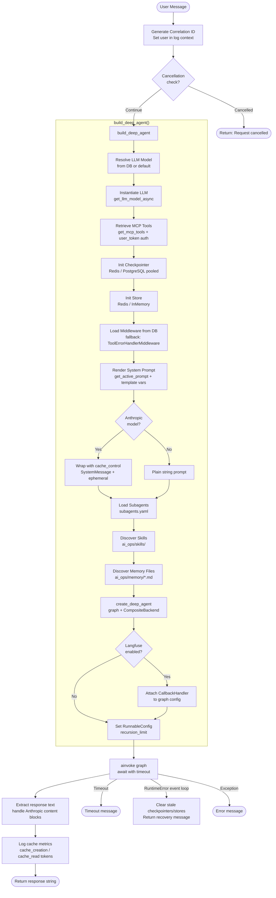
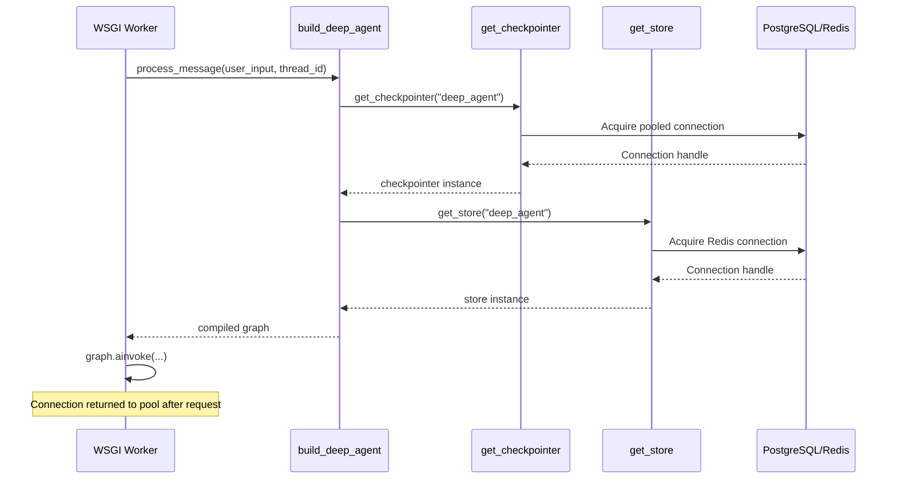

# Deep Agent Architecture

The Deep Agent is the production AI agent in AI Ops. It is built on the [deepagents](https://github.com/langchain-ai/deepagents) framework and processes every user query through a structured pipeline that assembles, runs, and tears down a LangGraph graph on each request.

This page documents the **actual runtime behavior** as implemented in [`ai_ops/agents/deep_mcp_agent.py`](../../ai_ops/agents/deep_mcp_agent.py).

---

## Runtime Flow

Every chat message triggers `process_message()`, which orchestrates the full request lifecycle:



---

## Component Reference

### `build_deep_agent()`

Assembles and returns a compiled LangGraph runnable. Called fresh on every request.

| Component | Source | Purpose |
| --------- | ------ | ------- |
| **LLM** | `get_llm_model_async()` | Instantiates the configured language model |
| **MCP Tools** | `get_mcp_tools()` | Fetches live tools from all healthy `MCPServer` records; passes `user_token` when present |
| **Checkpointer** | `get_checkpointer()` | Connection-pooled Redis or PostgreSQL saver; persists conversation state by `thread_id` |
| **Store** | `get_store()` | Cross-conversation memory (Redis-backed, falls back to InMemoryStore) |
| **Middleware** | `get_middleware()` from DB | Loaded fresh per-request to prevent state leaks; falls back to `ToolErrorHandlerMiddleware` |
| **System Prompt** | `get_active_prompt()` | Renders the active `SystemPrompt` with template variables (`{current_date}`, `{model_name}`, etc.) |
| **Subagents** | `agents/subagents.yaml` | YAML-defined specialized sub-agents; each can receive MCP tools |
| **Skills** | `ai_ops/skills/` | Directory of markdown instruction files injected at `/skills` virtual path |
| **Memory Files** | `ai_ops/memory/*.md` | Markdown files injected at `/memory/<filename>` virtual path |
| **Backend** | `CompositeBackend` | Routes `/memories/` → `StoreBackend`; everything else → `FilesystemBackend(ai_ops/)` |

---

## Anthropic Prompt Caching

When the active model is a `ChatAnthropic` instance, the system prompt is wrapped as a `SystemMessage` with `cache_control: ephemeral`. This tells Anthropic's API to cache the prompt prefix, reducing token costs on repeated queries.

```python
SystemMessage(content=[{
    "type": "text",
    "text": system_prompt,
    "cache_control": {"type": "ephemeral"},
}])
```

Cache performance is logged per-request:

```
[CacheMetrics] correlation_id=abc123 cache_creation=1204 cache_read=4820 input_tokens=312
```

---

## Middleware

Middleware is loaded fresh from the database on every request. If no middleware is configured in Nautobot, the agent falls back to `ToolErrorHandlerMiddleware` with the retry count from `TOOL_MAX_RETRIES`.

=== "DB-configured middleware"

    Navigate to **AI Platform → Middleware → LLM Middleware** to attach middleware to a model. All configured middleware is instantiated in priority order before each request.

=== "Default fallback"

    ```python
    # Triggered when no middleware exists in DB
    max_retries = int(os.getenv("TOOL_MAX_RETRIES", "2"))
    middleware.append(ToolErrorHandlerMiddleware(max_retries=max_retries))
    ```

---

## Subagent Configuration

Subagents are defined in [`ai_ops/agents/subagents.yaml`](../../ai_ops/agents/subagents.yaml). Each receives the full MCP tool set by default.

```yaml
nautobot-query:
  description: "Specialized agent for querying Nautobot inventory"
  system_prompt: "You are a Nautobot query specialist..."
  tools:
    - mcp_tools
```

The parent agent delegates to subagents automatically when the query matches the subagent's description. Subagents are loaded via `load_agents()` with `mcp_tools` injected at runtime.

---

## Skills System

Skills are markdown files in `ai_ops/skills/<skill-name>/SKILL.md`. They are exposed to the agent at the virtual path `/skills` and provide domain-specific instructions and examples.

```
ai_ops/skills/
└── nautobot-search/
    └── SKILL.md   ← instructions, examples, tool guidance
```

The agent reads skills via the `FilesystemBackend` and uses them to guide tool selection and response formatting.

---

## Cross-Conversation Memory

The `Store` component provides Redis-backed memory that persists *across* conversations (unlike the checkpointer, which persists *within* a thread).

- Accessible at the virtual path `/memories/` inside the agent
- Routes through `StoreBackend` in the `CompositeBackend`
- Falls back to `InMemoryStore` if Redis is unavailable

---

## Error Handling

| Error Type | Behavior |
| ---------- | -------- |
| `asyncio.TimeoutError` | Returns timeout message; request aborted after `AGENT_REQUEST_TIMEOUT` seconds |
| `RuntimeError` (event loop) | Clears stale checkpointer/store caches, returns recovery message; next request re-initializes them |
| All other `Exception` | Logs full traceback with correlation ID; returns user-friendly error string |

!!! warning "Event Loop Errors"
    These occur when cached async resources (checkpointers, stores) were bound to a now-closed event loop — typically after a WSGI worker restart. The agent self-heals by clearing and recreating the affected resources on the next request.

---

## Observability

### Langfuse (Optional)

Langfuse tracing is **opt-in** and disabled by default.

```bash
# Enable in your .env file
ENABLE_LANGFUSE=true
LANGFUSE_PUBLIC_KEY=pk-lf-...
LANGFUSE_SECRET_KEY=sk-lf-...
LANGFUSE_HOST=http://langfuse-web:3000
```

When enabled, a `CallbackHandler` is attached to the compiled graph via `RunnableConfig`. Because it is set at the graph level, it propagates automatically to all child runnables (LLM calls, tool calls, subagent calls).

See [Langfuse & Semantic Cache Setup](../langfuse_setup.md) for the full setup guide.

### Structured Request Logging

Every request produces structured log lines you can filter on:

| Log Event | Key Fields |
| --------- | ---------- |
| `[RequestStart]` | `correlation_id`, `thread`, `user`, `input_len` |
| `[build_deep_agent]` | `user_token_provided`, `token_length` |
| `[CacheMetrics]` | `cache_creation`, `cache_read`, `input_tokens` |
| `[RequestCompleted]` | `correlation_id`, `duration_ms` |
| `[timeout]` | `correlation_id` |
| `[event_loop_error]` | `correlation_id`, exception detail |
| `[error]` | `correlation_id`, `details` |

---

## Environment Variables

| Variable | Default | Description |
| -------- | ------- | ----------- |
| `AGENT_REQUEST_TIMEOUT` | `120` | Max seconds per request before timeout |
| `AGENT_RECURSION_LIMIT` | `100` | Max LangGraph recursion depth |
| `TOOL_MAX_RETRIES` | `2` | Retry count for `ToolErrorHandlerMiddleware` (fallback only) |
| `ENABLE_LANGFUSE` | `false` | Enable Langfuse LLM observability |
| `LANGFUSE_PUBLIC_KEY` | — | Langfuse public API key |
| `LANGFUSE_SECRET_KEY` | — | Langfuse secret API key |
| `LANGFUSE_HOST` | `http://localhost:3000` | Langfuse server URL |
| `REDIS_URL` | — | Redis connection URL (checkpointer + store) |

!!! note "Django Constance settings"
    `agent_request_timeout_seconds` and `agent_recursion_limit` can also be configured per-environment in Nautobot's Constance settings (Admin → Constance). The environment variables take precedence at module import time.

---

## Connection Lifecycle



Connection pools are managed by `checkpoint_factory.py` and `store_factory.py`. If a cached connection is bound to a closed event loop, it is detected and recreated automatically.

---

## Directory Structure

```
ai_ops/
├── agents/
│   ├── deep_mcp_agent.py       ← This agent
│   ├── multi_mcp_agent.py      ← Standard agent (simpler, no deepagents)
│   └── subagents.yaml          ← Subagent definitions
├── helpers/
│   └── deep_agent/
│       ├── __init__.py
│       ├── checkpoint_factory.py   ← Pooled Redis/PostgreSQL checkpointers
│       ├── store_factory.py        ← Redis/InMemory store
│       ├── middleware.py           ← ToolErrorHandlerMiddleware, ToolResultCacheMiddleware
│       ├── mcp_tools_auth.py       ← MCP tool retrieval with auth
│       ├── agents_loader.py        ← YAML subagent loader
│       └── backend_factory.py      ← CompositeBackend setup
├── skills/                         ← Skill instruction files
│   └── <skill-name>/
│       └── SKILL.md
└── memory/                         ← Cross-request markdown context files
    └── *.md
```

---

## Comparison: Standard Agent vs Deep Agent

| Feature | Standard Agent (`multi_mcp_agent`) | Deep Agent (`deep_mcp_agent`) |
| ------- | ---------------------------------- | ----------------------------- |
| **Framework** | LangChain `create_agent` | `deepagents.create_deep_agent` |
| **Checkpointer** | In-memory (MemorySaver) | Redis / PostgreSQL with connection pooling |
| **Store** | None | Redis / InMemory (cross-conversation) |
| **Tool Retry** | None | `ToolErrorHandlerMiddleware` (configurable) |
| **Subagents** | No | Yes, YAML-defined |
| **Skills** | No | Yes, directory-based markdown |
| **Memory Files** | No | Yes, `ai_ops/memory/*.md` |
| **Anthropic Caching** | No | Yes, `cache_control: ephemeral` on system prompt |
| **Langfuse Tracing** | No | Optional, graph-level callbacks |
| **MCP Tool Auth** | Cached per warmup | Fresh `user_token` per request |

---

## Troubleshooting

=== "Subagents not loading"

    ```bash
    # Verify the file exists
    ls -la ai_ops/agents/subagents.yaml

    # Check logs for
    # [deep_agent] Subagents loaded: N
    ```

=== "MCP tool authentication failures"

    ```bash
    # Verify MCPServer status in Nautobot
    # AI Platform → MCP → MCP Servers → all must be "Healthy"

    # Check logs for
    # [get_mcp_tools] Retrieving MCP tools (authenticated=True)
    # [deep_agent] Retrieved N MCP tools
    ```

=== "Event loop / connection pool errors"

    ```bash
    # The agent self-heals — check logs for
    # [event_loop_error] Cleared cached checkpointers/stores

    # If errors persist, restart the Nautobot worker
    systemctl restart nautobot-worker
    ```

=== "Langfuse not receiving traces"

    ```bash
    # Verify services are running
    docker compose ps langfuse-web langfuse-worker

    # Check env vars are set
    echo $LANGFUSE_PUBLIC_KEY
    echo $ENABLE_LANGFUSE   # must be "true"

    # Check logs for
    # [deep_agent] Langfuse callback attached to graph
    ```

---

## References

- [deepagents framework](https://github.com/langchain-ai/deepagents)
- [LangGraph Persistence (Checkpointer)](https://langchain-ai.github.io/langgraph/concepts/persistence/)
- [LangGraph Memory (Store)](https://langchain-ai.github.io/langgraph/concepts/memory/)
- [Anthropic Prompt Caching](https://docs.anthropic.com/en/docs/build-with-claude/prompt-caching)
- [Langfuse LLM Observability](https://langfuse.com/docs)
